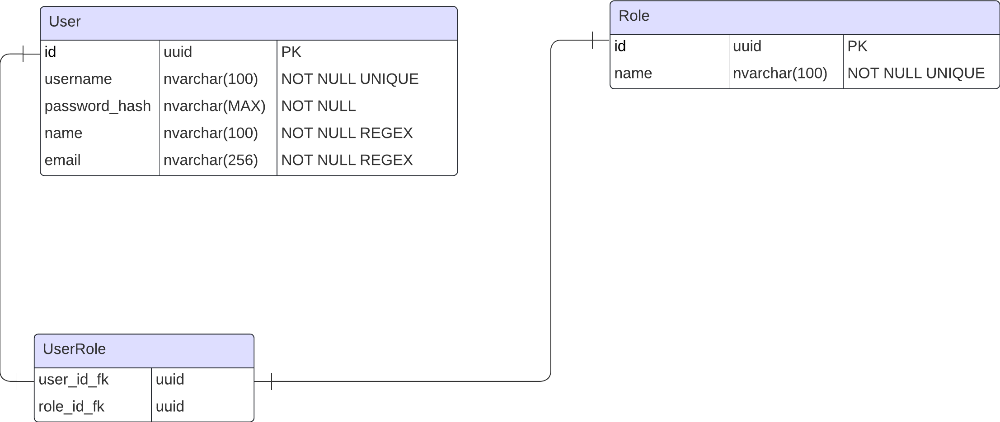
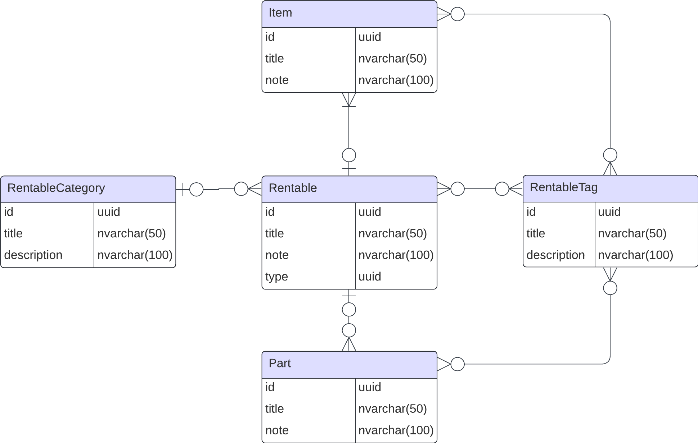

# Development of Marquee Rental Service Web Application

Web application for a marquee rental service company.  Developed for internal use to streamline operations for company workers within different departments and workflows.

## Table of Contents

1. [Project Description](#project-description)
2. [For Developers](#for-developers)
    1. [Setup development environment](#setup-development-environment)
        1. [Setup development tools](#setup-development-tools)
            1. [Hot Module Reload](#hot-module-reload)
            2. [pgadmin](#pgadmin)
        2. [🚀 NPM scripts for Docker](#-npm-scripts-for-docker)
            1. [📦 Under the hood](#-under-the-hood)
    2. [Workflow](#workflow)
        1. [Issues](#issues)
2. [Features](#features)
    1. [(AA) Authenication and Authorization](#authenication-and-authorization)
    2. [(IMS) Inventory Management System](#inventory-management-system)
3. [Potential Future Features](#potential-future-features)

## Project Description

lorem ipsum...

## For Developers
This section covers neccessary information for further development of the project.

### Setup development environment

1. Clone the repository
2. Create .env file in root directory and set variables
```
DB_PORT= (Port number for the database container) // Only development
API_PORT= (Port number for the API container) // Only development
FRONTEND_PORT= (Port number for frontend container)
POSTGRES_HOST= (Name of the postgres container)
POSTGRES_USER= (Username for default user in postgres database)
POSTGRES_PASSWORD= (Password for default user in postgres database)
POSTGRES_DB= (Name of the database)
PGADMIN_EMAIL= (Email for Postgres Admin Login)
PGADMIN_PASSWORD= (Password for Postgres Admin Login)
```
3. Run `docker-compose -f compose.dev.yaml up --build -d` when in root directory
4. Verify success with `docker ps`
5. Access frontend at [http://www.localhost:[FRONTEND_PORT]](http://www.localhost:3000)

### Setup development tools
Some tools are made available in the development environment. See the sections below on how to use them.

#### Hot Module Reload

1. Run `docker-compose -f compose.dev.yaml up --build -d` to rebuild and start all containers.
2. Run `docker-compose -f compose.dev.yaml up frontend --build --watch` to allow hot module reload for the frontend.

#### pgadmin

1. Run `docker-compose --profile tools up` to containerize tools such as pgadmin used for database debugging.
2. Access pgadmin at [localhost:8080](localhost:8080).
3. Login using .env variable for `PGADMIN_EMAIL` and `PGADMIN_PASSWORD`.
4. Connect to the database by **Adding a new Server**.
5. Set the name to your choosing.
6. Navigate to the **Connection** tab.
7. Enter the host name address to match the service name, by default `db`.
8. Enter the username, should match that of .env variable: `POSTGRES_USER`.
9. Enter the password, should match that of .env variable: `POSTGRES_PASSWORD`.
10. Press save.
11. You can now access the database using pgadmin.

> [!CAUTION] 
> You need to use `docker-compose --profile tools down` to properly stop the pgadmin container.

### 🚀 NPM Scripts for Docker

Skip the long `docker-compose` commands with these handy npm scripts.  
Just make sure you have your `.env` file in place.

#### 🔧 Available Commands

- **`npm run docker:all`** – Spins up all services (frontend, backend, db) with fresh builds.
- **`npm run docker:frontend`** – Starts only the frontend (no backend/db).
- **`npm run docker:backend`** – Starts only the backend (no db).

#### 📦 Under the Hood

```bash
# docker:all
docker-compose -f compose.dev.yaml up --build -d

# docker:frontend
docker-compose -f compose.dev.yaml up --no-deps -d frontend

# docker:backend
docker-compose -f compose.dev.yaml up --no-deps -d backend
```

### Workflow

To allow for efficient development with focus on refactorization, each issue should be tackled with intent of creating modular solutions. For example:

Issue: Display users on dedicated page on the frontend
Solution: Create re-usable script for fetching, then use script to fetch data and display on page.
Why: Changes to the API endpoint (for example due to introducing authorization), does not require multiple scripts to be altered. Instead only the script dedicatetd for fetching requires updating.

#### Issues

1. Open the issue on github.com
2. Assign the issue to yourself.
3. Create a branch for the issue
4. On development machine, run `git fetch origin`
5. On development machine, run `git checkout <issue-branch-name>`


## Features

The system includes a variety of features designed to streamline operations. Each feature corresponds to a department or major workflow within the company, and may consist of multiple sub-features, referred to as functionalities. These functionalities are tailored to support specific tasks within the broader feature. Each listed feature is detailed in their respective sections below. Features currently being implemented or already implemented include:

- [ ] Authentication and Authorization (AA)
- [ ] Inventory Management System (IMS)

### Authenication and Authorization

The Authentication and Authorization features enables the use of role-based authentication and claim-based authentication to restrict access to certain features and resources. The following features entail details on how authorization has been utilized specificallty in the respective feature. The roles have been developed using *the principle of least prielege*. The table below lists the currently available roles, the respective feature they relate to, and a description of the permission given to each role.

|Role|Feature|Description|
|---|---|---|
|Admin|Global|Posseses all permissions within the system, including administrative and configuration capabilites.|
|Role Manager|AA|Posseses permissions to manage roles, including adding and removing roles, as well as managing permissions given to roles.|
|User Manager|AA|Posseses permissions to manage users and their roles, including adding, removing, and updating users, whilst also managing users' roles.|
|Inventory Manager|IMS|Posseses all permissions given within the inventory management system. Including adding, editing, deleting inventory items, and modyfying the list of items.|
|Inventory Worker|IMS|Posseses the minimal required permissions to perform daily inventory tasks, such as updating stock levels and recording transactions.|
|Inventory Viewer|IMS| Posseses read-only permissions, allowing them to view inventory data without making any changes.|

#### AA Functionalities

|Name|Purpose|Description|
|---|---|---|
|Login|Allows for the authentication of users.|The user is required to log in when accessing the internal pages.|
|Authorized routing|Restricts access to certain functionalities by restricting page access to certain roles and claims.|The user is required to posses the correct permissions to access restricted pages.|
|Tokens|Provides secure token-based authentication and authorization.|JWT (JSON Web Tokens) are used to securely transmit information between parties and verify user identities and permissions.|
|Role Dashboard|Allows the user to modify the roles within the system.|The user may add, update, and remove roles. The user may also modify a roles' permissions by modifying its claims.|
|User Dashboard|Allows the user to access the user within the system.|The user may add, update, and remove users within the system. The user may also modify a user's permissions either by modifying their roles or claims.|

#### AA Database Diagram

The database diagram relating to authentication and authorization within the application is shown below.


### Inventory management system

The inventory management system helps workers to efficiently track and update inventory. It allows the users to update the item quantity in stock, rented out, and marked faulty for each item available in the system. Additionally, the system supports role-based access control, enabling certain users to edit the inventory items themselves based on their assigned role. The system uses general-purpose objects to accommodate a wide range of items that may be stored in the inventory, ensuring flexibility and scalability.

#### Inventory Database Diagram


|Table|Purpose|Real-world example|
|---|---|---|
|Rentable|Items that are available for rental.|A 5x5 tent.|
|Part|Interchangeble parts for specific rentables.|Window roof, standard roof, window wall, standard wall.|
|Item|Common parts used in multiple a rentable.|Nails, bolts.|
|RentableCategory|A category of rentables.|Tents, decor.|
|RentableTag|A tag for rentables.|New, dirty, faulty.|

#### Inventory Functionalities

|Name|Purpose|Description|
|---|---|---|
|Inventory List|Allows users to CRUD the items within list which the inventory is based off of.|A user may add a new tent model to keep inventory of.|
|Inventory Items|Allows users to adjust the quantity of items in stock and rented out.|A user may adjust the number of tents in stock.|
|Inventory Categories|Allows the users to CRUD categories which are used to categorize items within the inventory.|A user may categorize an item as a tent.|
|Inventory Tags|Allows the users to CRUD tags which are used to tag items as for example "dirty", "broken", etc.|A user may tag an item as dirty.|

#### Authorization within Inventory subsystem

The roles associated with the inventory management system have been listed and described in the table below. The roles are listed so that the ones in the top of the table have the most permissions.

|Role|Description|
|---|---|
|Inventory Manager|Has full control over the inventory system, including the ability to add, edit, and remove items, and update item quantities (in stock, rented out, faulty), types, and tags.|
|Inventory Worker|Responsible for the day-to-day management of inventory. They can update the status of items (in stock, rented out, faulty), record transactions, and report discrepancies using the existing tags.|
|Inventory Viewer|Has read-only access to the inventory system. They can view items, quantities, and associated tags but cannot make any changes to the inventory data. This role is suitable for users who need to monitor inventory levels and statuses without directly interacting with or modifying the data.|

## Potential future features

- [ ] **Booking management system:** Utilize knapsack problem solution to re-calculate inventory to optimize resource distribution.

### Dependencies
Found in [.dependencies](.dependencies).